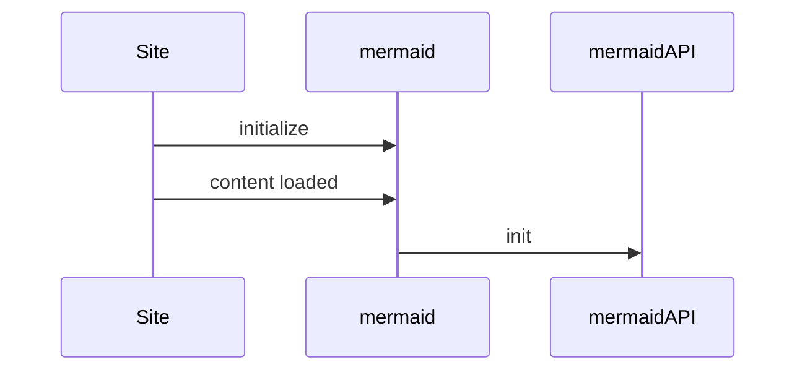

# Mermaid Shortcode

## Installation for Gethugothemes themes

Add the following code to your module list in the `config/_default/module.toml` file.

```toml
[[imports]]
path = "github.com/gethugothemes/hugo-modules/shortcodes/mermaid"
```

<hr>

## Acknowledgments

This shortcode is built using [mermaid-js](https://mermaid.js.org/).

## Installation for other themes

Add the following script to your theme header.

```html
<script type="module">
  import mermaid from "https://cdn.jsdelivr.net/npm/mermaid@11.12.1/+esm";
  mermaid.initialize({ startOnLoad: true });
</script>
```

Then use it as follows:

```html
<pre class="mermaid">
sequenceDiagram
	Site->>mermaid: initialize
	Site->>mermaid: content loaded
	mermaid->>mermaidAPI: init
<pre>
```

## Shortcode Implementation

```md

sequenceDiagram
	Site->>mermaid: initialize
	Site->>mermaid: content loaded
	mermaid->>mermaidAPI: init


```

Alternatively, you can use standard Markdown fenced code blocks:



---

Configuration options can be passed in the front matter of the shortcode using the `---` delimiter. For example:
for more advanced configuration, you can read the [mermaid-js documentation](https://mermaid.js.org/config/theming.html).

```md

---
title: Hello Title
config:
  theme: neutral
---
sequenceDiagram
	Site->>mermaid: initialize
	Site->>mermaid: content loaded
	mermaid->>mermaidAPI: init

```

---
